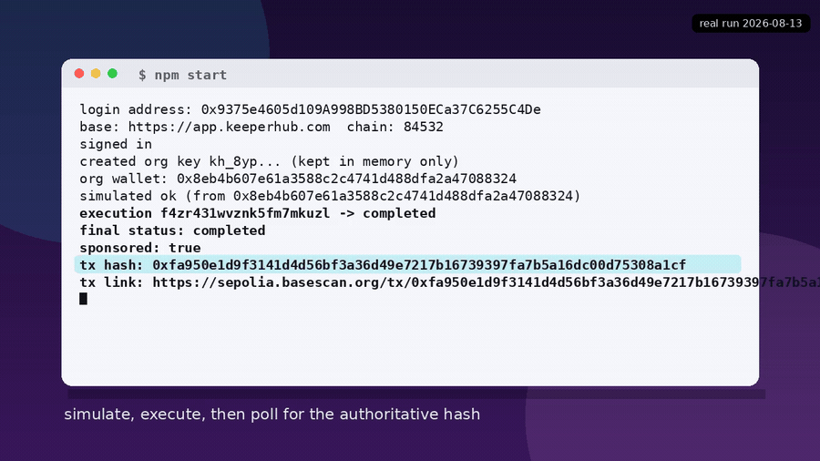

# KeeperHub: zero to your first onchain transaction

## Demo



The clip above plays inline: `npm start` lands a real Base Sepolia transaction, then the
run reads the onchain receipt back. Watch the full 43-second version with sound, including
the `npm run doctor` preflight: [vibe-starter-demo.mp4](https://github.com/zkasuran/vibe-starter/releases/download/v0.1.0/vibe-starter-demo.mp4).

A clone-and-run starter that takes a new builder from nothing to a first
verified onchain transaction through KeeperHub, with no browser and no faucet.
It signs in with a wallet, mints an organization API key, finds the wallet that
signs, simulates a transfer, executes it, then reads the transaction hash back
from the authoritative status endpoint.

The first run defaults to a zero-value self-transfer on Base Sepolia. A brand
new organization wallet holds nothing. On the sponsored chains the relayer pays
the gas, so an empty wallet still lands a real, mined, independently verifiable
transaction. No funding step stands between clone and first tx.

## What you need

- Node 20 or newer (`Headers.getSetCookie()` is used and does not exist before
  20). Check with `node -v`.
- A throwaway EOA private key. The template generates one for you.

## Quickstart

```bash
npm install
cp .env.example .env

# 1. make a throwaway key and paste the printed line into .env
npm run keygen

# 2. preflight: connectivity, the /api/api trap, key format. Needs no key.
npm run doctor

# 3. sign in, mint a key, simulate, execute, land the transaction
npm start
```

`npm start` prints the login address, the organization wallet, the execution id
and, at the end, the transaction hash and a block-explorer link.

## What the run does

The path follows KeeperHub's documented headless flow. Each step maps to a real
endpoint:

1. **Sign in with Ethereum** (`POST /api/auth/siwe/nonce`, then
   `/api/auth/siwe/verify`). For a wallet KeeperHub has not seen, signing in also
   signs up. It creates the user, an organization and the organization wallet.
2. **Create an organization key** (`POST /api/keys`). The first call answers with
   a challenge to sign. The template signs that challenge and repeats the call,
   which returns the `kh_` key once.
3. **Find the wallet that signs** (`GET /api/user` -> `walletAddress`). This is
   the organization wallet, not the address you logged in with. Provisioning runs
   in the background, so the template polls until it appears.
4. **Simulate** (`POST /api/execute/transfer` with `simulate: true`). The dry run
   catches reverts, bad addresses and balance shortfalls before any gas is spent.
5. **Execute and confirm** (the same body without `simulate`, plus an
   `Idempotency-Key`, then poll `GET /api/execute/{id}/status`). The status
   response carries the authoritative transaction hash and link.

## Verified run

This template was run end to end on 2026-08-13 against the live API. `npm start`
signed up a fresh wallet, minted a key, simulated, executed and confirmed:

```
login address: 0x9375e4605d109A998BD5380150ECa37C6255C4De
org wallet: 0x8eb4b607e61a3588c2c4741d488dfa2a47088324
execution f4zr431wvznk5fm7mkuzl -> completed
final status: completed
sponsored: true
tx hash: 0xfa950e1d9f3141d4d56bf3a36d49e7217b16739397fa7b5a16dc00d75308a1cf
tx link: https://sepolia.basescan.org/tx/0xfa950e1d9f3141d4d56bf3a36d49e7217b16739397fa7b5a16dc00d75308a1cf
```

The receipt confirms onchain, checked against two public Base Sepolia RPCs
(`sepolia.base.org` and `base-sepolia-rpc.publicnode.com`):

```
status 0x1  block 45421366  gasUsed 40933
from 0x6331...091e99 (relayer)  to 0x5af5...77f07d (delegation wrapper)
```

The onchain `from` is the relayer, not the organization wallet, because the write
was gas-sponsored through an EIP-7702 path. That is expected. Treat the
`transactionHash` from the status endpoint as the record, not the explorer
summary line. See "sponsored executions" in the KeeperHub docs.

## The friction this removes

A newcomer today assembles the first-transaction path from several separate doc
pages and hits a few traps that read like broken endpoints. Each one below was
observed live. The template turns the whole path into one command.

- **The path is spread across pages.** Headless sign-in, key creation, wallet
  funding, direct execution and status polling each live on their own page.
  There is no single clone-and-run path. This template is that path.

- **The `/api/api` double-prefix 404.** The docs write full URLs, so it is easy
  to set a client base of `https://app.keeperhub.com/api` and then append
  `/api/workflows`, which hits `/api/api/workflows`. That now answers `404` with
  `error: "doubled_api_prefix"` and a hint, which is good, but the trap is still
  easy to walk into. `npm run doctor` demonstrates it live and the client keeps
  `/api` out of the base URL so you never hit it.

- **A non-zero first transfer looks like a broken API.** A new organization
  wallet is empty, so a first transfer with a real amount fails inside the
  simulator with a `CALL_EXCEPTION` that names neither the balance nor the
  wallet. It reads as a broken endpoint. The template defaults `amount` to `0`,
  which a zero-balance wallet can land because the relayer pays the gas, so the
  first run proves the whole path before any value is at stake.

- **The wallet that signs is not the wallet you logged in with.** Execution is
  organization-scoped, so the transaction is signed by the organization wallet,
  a different address from your login wallet. The template reads it from
  `GET /api/user` and prints it, so you fund the right address when you move
  value later.

- **The signature challenge is single-use.** Creating a key is a two-step
  challenge-and-sign. The nonce in the first response is minted fresh and expires
  fast, so you must sign the challenge from that exact response. The template does
  this in order and does not cache the challenge.

## Going past the first transaction

To move real value, set `AMOUNT` and `RECIPIENT` in `.env` on a wallet that
holds funds. Read the balance first: on mainnet the sponsored-gas allowance is
finite. When it runs out the wallet pays its own gas. To run on Base mainnet
set `CHAIN_ID=8453`. The simulate step still runs first, so a transfer the wallet
cannot afford is caught before broadcast.

For multi-step logic rather than a single transfer, author a workflow in the
browser or with an agent, then call `POST /api/workflows/{id}/execute` and poll
`GET /api/workflows/executions/{id}/wait`. Same key, same shape.

## Files

- `src/config.ts` loads `.env` with no dependency and normalizes the base URL.
- `src/client.ts` is the fetch wrapper: a cookie jar for session calls and a
  tolerant JSON parse.
- `src/doctor.ts` is the preflight. It needs no key.
- `src/onboard.ts` is the full path.
- `src/keygen.ts` prints a throwaway key and its address.

## AI disclosure

AI assistance (Claude, Anthropic) was used to build this template. The design,
the review and the verification were done by the author, zkasuran. Verified
locally before publishing: `npm run typecheck` is clean. `npm run doctor` passed
every check against the live API. `npm start` landed the Base Sepolia
transaction linked above, with its receipt confirmed against two independent
public RPCs.
